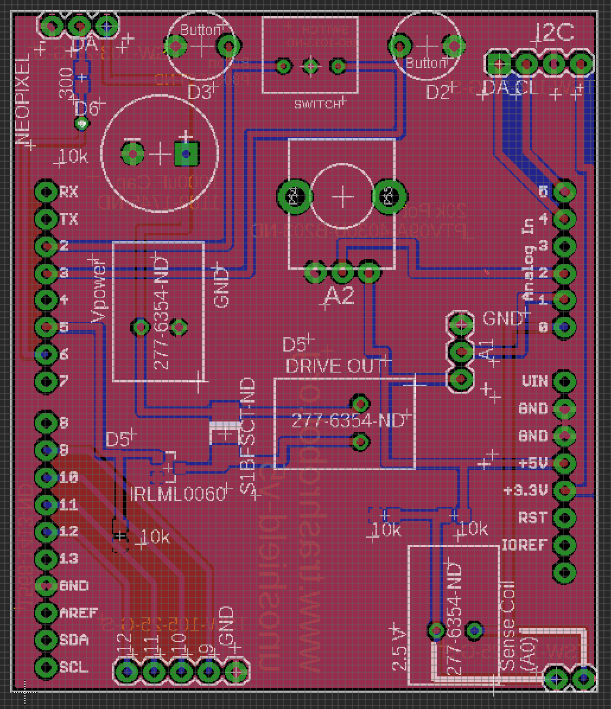
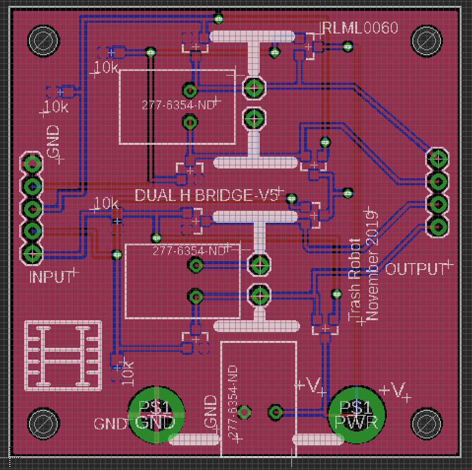

## [link up a level../](../)

# Trash robot

## UNO Shield

[link to page on pcbway to buy board](https://www.pcbway.com/project/shareproject/Generic_Trash_Robot_UNO_Shield__V5.html)

## UNO Shield BOM

| REFDES|value| source/part#| 
|-------|-----|-------------|
|   R1  | 10k | [digikey RNCP0603FTD10K0CT-ND](https://www.digikey.com/product-detail/en/panasonic-electronic-components/ERJ-3EKF3301V/P3.30KHCT-ND/1746762)  | 
|   R2  | 10k | [digikey RNCP0603FTD10K0CT-ND](https://www.digikey.com/product-detail/en/panasonic-electronic-components/ERJ-3EKF3301V/P3.30KHCT-ND/1746762)  | 
|   R3  | 10k | [digikey RNCP0603FTD10K0CT-ND](https://www.digikey.com/product-detail/en/panasonic-electronic-components/ERJ-3EKF3301V/P3.30KHCT-ND/1746762)  | 
|   R4  | 300 | [digikey RR08P300DCT-ND](https://www.digikey.com/product-detail/en/susumu/RR0816P-301-D/RR08P300DCT-ND/432711)  | 
|   R5  |10k pot| [digikey PTV09A-4225F-B103-ND](https://www.digikey.com/product-detail/en/bourns-inc/PTV09A-4225F-B103/PTV09A-4225F-B103-ND/3781155)  | 
|   Q1  |MOSFET| [digikey IRLML0060TRPBFCT-ND](https://www.digikey.com/product-detail/en/infineon-technologies/IRLML0060TRPBF/IRLML0060TRPBFCT-ND/2202229)  | 
|   D1  |DIODE| [digikey S1BFSCT-ND](https://www.digikey.com/product-detail/en/on-semiconductor/S1B/S1BFSCT-ND/965719)  | 
|   C1  |1000uF| [digikey 1189-1745-ND](https://www.digikey.com/product-detail/en/rubycon/35PX1000MEFC10X20/1189-1745-ND/3563769)  | 
|   X1  |CONTACT| [digikey 277-6354-ND](https://www.digikey.com/product-detail/en/phoenix-contact/1984963/277-6354-ND/2513976)  | 
|   X2  |CONTACT| [digikey 277-6354-ND](https://www.digikey.com/product-detail/en/phoenix-contact/1984963/277-6354-ND/2513976)  | 
|   X3  |CONTACT| [digikey 277-6354-ND](https://www.digikey.com/product-detail/en/phoenix-contact/1984963/277-6354-ND/2513976)  | 
|   SW1  |BUTTON| [digikey P15931SCT-ND](https://www.digikey.com/product-detail/en/panasonic-electronic-components/EVQ-11D05B/P15931SCT-ND/3873336)  | 
|   SW2  |BUTTON| [digikey P15931SCT-ND](https://www.digikey.com/product-detail/en/panasonic-electronic-components/EVQ-11D05B/P15931SCT-ND/3873336)  | 
|   SW3  |SPDT| [digikey 360-1013-ND](https://www.digikey.com/product-detail/en/nkk-switches/B13AP/360-1013-ND/379100)  | 
|   J1  |3x HEADERS| [digikey SAM1029-03-ND](https://www.digikey.com/product-detail/en/samtec-inc/TSW-103-07-G-S/SAM1029-03-ND/1101324)| 
|   J2  |4x HEADERS| [digikey SAM1029-04-ND](https://www.digikey.com/product-detail/en/samtec-inc/TSW-104-07-G-S/SAM1029-04-ND/1101323)| 
|   J3  |5x HEADERS| [digikey SAM1029-05-ND](https://www.digikey.com/product-detail/en/samtec-inc/TSW-105-07-G-S/SAM1029-05-ND/1101322)| 
|   J4  |ARDUINO HEADERS| [digikey 1528-1074-ND](https://www.digikey.com/product-detail/en/adafruit-industries-llc/85/1528-1074-ND/5154649)|
|   JS1  |3X SOCKET| [digikey SAM1206-03-ND](https://www.digikey.com/product-detail/en/samtec-inc/SSQ-103-03-T-S/SAM1206-03-ND/1111955)|
|   JS2  |4X SOCKET| [digikey SAM1206-04-ND](https://www.digikey.com/product-detail/en/samtec-inc/SSQ-104-03-T-S/SAM1206-04-ND/1111954)|
|   JS3  |5X SOCKET| [digikey SAM1206-05-ND](https://www.digikey.com/product-detail/en/samtec-inc/SSQ-105-03-T-S/SAM1206-05-ND/1111953)|

## Dual H Bridge

[link to buy on PCBway](https://www.pcbway.com/project/shareproject/Dual_H_Bridge__V_5.html)

## Dual H Bridge BOM

| REFDES|value| source/part#| 
|-------|-----|-------------|
|   R1  | 10k | [digikey RNCP0603FTD10K0CT-ND](https://www.digikey.com/product-detail/en/panasonic-electronic-components/ERJ-3EKF3301V/P3.30KHCT-ND/1746762)  | 
|   R2  | 10k | [digikey RNCP0603FTD10K0CT-ND](https://www.digikey.com/product-detail/en/panasonic-electronic-components/ERJ-3EKF3301V/P3.30KHCT-ND/1746762)  | 
|   R3  | 10k | [digikey RNCP0603FTD10K0CT-ND](https://www.digikey.com/product-detail/en/panasonic-electronic-components/ERJ-3EKF3301V/P3.30KHCT-ND/1746762)  | 
|   R4  | 10k | [digikey RNCP0603FTD10K0CT-ND](https://www.digikey.com/product-detail/en/panasonic-electronic-components/ERJ-3EKF3301V/P3.30KHCT-ND/1746762)  | 
|   Q1  |MOSFET| [digikey IRLML0060TRPBFCT-ND](https://www.digikey.com/product-detail/en/infineon-technologies/IRLML0060TRPBF/IRLML0060TRPBFCT-ND/2202229)  | 
|   Q2  |MOSFET| [digikey IRLML0060TRPBFCT-ND](https://www.digikey.com/product-detail/en/infineon-technologies/IRLML0060TRPBF/IRLML0060TRPBFCT-ND/2202229)  | 
|   Q3  |MOSFET| [digikey IRLML0060TRPBFCT-ND](https://www.digikey.com/product-detail/en/infineon-technologies/IRLML0060TRPBF/IRLML0060TRPBFCT-ND/2202229)  | 
|   Q4  |MOSFET| [digikey IRLML0060TRPBFCT-ND](https://www.digikey.com/product-detail/en/infineon-technologies/IRLML0060TRPBF/IRLML0060TRPBFCT-ND/2202229)  | 
|   Q5  |MOSFET| [digikey IRLML0060TRPBFCT-ND](https://www.digikey.com/product-detail/en/infineon-technologies/IRLML0060TRPBF/IRLML0060TRPBFCT-ND/2202229)  | 
|   Q6  |MOSFET| [digikey IRLML0060TRPBFCT-ND](https://www.digikey.com/product-detail/en/infineon-technologies/IRLML0060TRPBF/IRLML0060TRPBFCT-ND/2202229)  | 
|   Q7  |MOSFET| [digikey IRLML0060TRPBFCT-ND](https://www.digikey.com/product-detail/en/infineon-technologies/IRLML0060TRPBF/IRLML0060TRPBFCT-ND/2202229)  | 
|   Q8  |MOSFET| [digikey IRLML0060TRPBFCT-ND](https://www.digikey.com/product-detail/en/infineon-technologies/IRLML0060TRPBF/IRLML0060TRPBFCT-ND/2202229)  | 
|   X1  |CONTACT| [digikey 277-6354-ND](https://www.digikey.com/product-detail/en/phoenix-contact/1984963/277-6354-ND/2513976)  | 
|   X2  |CONTACT| [digikey 277-6354-ND](https://www.digikey.com/product-detail/en/phoenix-contact/1984963/277-6354-ND/2513976)  | 
|   X3  |CONTACT| [digikey 277-6354-ND](https://www.digikey.com/product-detail/en/phoenix-contact/1984963/277-6354-ND/2513976)  | 
|   J1  |4x RA HEADERS| [digikey TSW-104-25-G-S-RA-ND](https://www.digikey.com/product-detail/en/samtec-inc/TSW-104-25-G-S-RA/TSW-104-25-G-S-RA-ND/7864906)| 
|   J2  |5x RA HEADERS| [digikey TSW-105-25-G-S-RA-ND](https://www.digikey.com/product-detail/en/samtec-inc/TSW-105-25-G-S-RA/TSW-105-25-G-S-RA-ND/2685928)| 
|   JS1  |4X SOCKET| [digikey SAM1206-04-ND](https://www.digikey.com/product-detail/en/samtec-inc/SSQ-104-03-T-S/SAM1206-04-ND/1111954)|
|   JS2  |5X SOCKET| [digikey SAM1206-05-ND](https://www.digikey.com/product-detail/en/samtec-inc/SSQ-105-03-T-S/SAM1206-05-ND/1111953)|

## Kit BOM

|Description|Link|
|-----------|----|
|Jumper Wires|[Digikey 1528-1160-ND](https://www.digikey.com/product-detail/en/adafruit-industries-llc/824/1528-1160-ND/5353620)|
|Solder Paste|[Digikey SMDLTLFP-ND](https://www.digikey.com/product-detail/en/chip-quik-inc/SMDLTLFP/SMDLTLFP-ND/2682721)|
|2.1X5 MM Barrel Breakout|[Digikey 839-1518-ND](https://www.digikey.com/product-detail/en/tensility-international-corp/10-02931/839-1518-ND/9686414)|
|2.1X5 MM Barrel patch cable|[Amazon $6.99](https://www.amazon.com/Valley-Enterprises%C2%AE-2-1mm-5-5mm-Adapter/dp/B00DX72UXW/)|
| 12V 12Ah LiPo|[Amazon $33.99](https://www.amazon.com/gp/product/B00ME3ZH7C/)|
| 12V 3Ah LiPo |[Amazon $24.19](https://www.amazon.com/TalentCell-Rechargeable-3000mAh-Lithium-External/dp/B01M7Z9Z1N/) |
|30 AWG Magnet wire|[Amazon $17.45](https://www.amazon.com/dp/B07SG4CPSF/) |
| Arduino Uno | [Amazon $8.49](https://www.amazon.com/HiLetgo-ATmega328P-Development-Compatible-Microcontroller/dp/B01AR7YJ3O/) |
| Hookup Wire Kit | [Adafruit $19.95](https://www.adafruit.com/product/3111) |
| 3 axis Accelerometer | [Adafruit $7.95](https://www.adafruit.com/product/2019) |
| I2C Pressure Sensor| [Adafruit $9.95](https://www.adafruit.com/product/2651) |
|ultrasonic range finder|[Sparkfun $3.95](https://www.sparkfun.com/products/15569)|
| Neopixel 8x array| [Adafruit $5.95](https://www.adafruit.com/product/1426) |
| Hot Air Rework Tool| [Sparkfun $129.95](https://www.sparkfun.com/products/14557) |
| Soldering Iron| [Sparkfun $129.00](https://www.sparkfun.com/products/14734) |
| Lead Free Solder| [Sparkfun $7.95](https://www.sparkfun.com/products/9325) |

- [boards/unoshield-v5.brd](boards/unoshield-v5.brd)
- [boards/unoshield-v5.sch](boards/unoshield-v5.sch)
- [boards/unoshield-v5-bom.xlsx](boards/unoshield-v5-bom.xlsx)
- [boards/dualHbridge-v5.brd](boards/dualHbridge-v5.brd)
- [boards/dualHbridge-v5.sch](boards/dualHbridge-v5.sch)
- [boards/dualHbridge-v5bom.xlsx](boards/dualHbridge-v5bom.xlsx)

